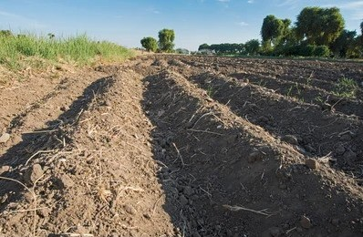
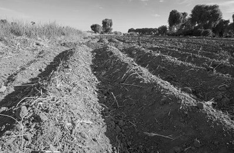
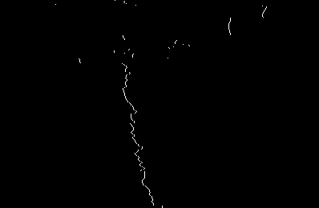
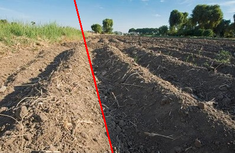

# furrow-line-detection

Proof-of-concept implementation of crop-field furrow line detection using simple image processing techniques. 

Meant to be deployed on an agricultural rover. Part of my internship work at T-Works, Hyderabad.

---

## Overview
This project implements a classical computer vision pipeline for **automatic detection of furrow lines** in agricultural field images. The idea was to have a simple, quick, non-ML based algorithm to help with agricultural rover traversal along furrow lines.

The pipeline performs:
- Histogram-based analysis
- Frequency-domain (DFT) feature extraction
- Row-wise edge detection
- Hough transform-based line detection

---

## Note:
- Configurable via command-line arguments (window size, Hough thresholds, theta ranges). These parameters were meant to be tuned in-field, taking into consideration the rover geometry and camera placement.
- This method is obviously susceptible to lighting changes and is not very robust.
- We never ended up recieving on-field images, so the default tuning is as per whatever relevant images could be found online.

---

## Example

Below is an example workflow of the pipeline on a sample field image.

### 1. Input Image
Original RGB image of the crop field / furrows.

---

### 2. Grayscale Conversion
The input image is converted to grayscale for histogram and edge analysis.

---

### 3. Max Difference Image
Row-wise intensity differences are computed to highlight potential furrow locations. White pixels indicate areas of maximum difference.

---

### 4. Detected Furrow Line
The first valid line detected using Hough transform is overlaid in red.

